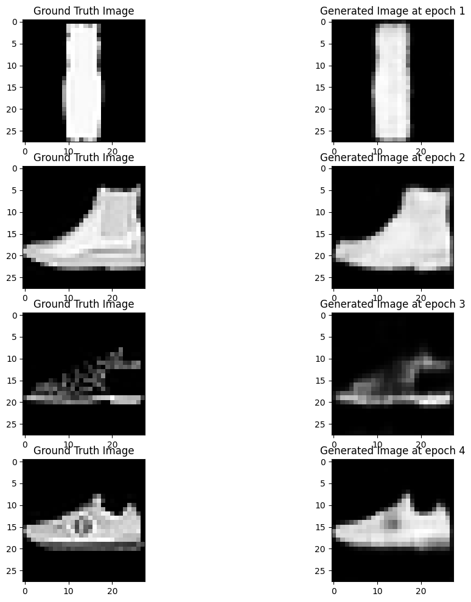
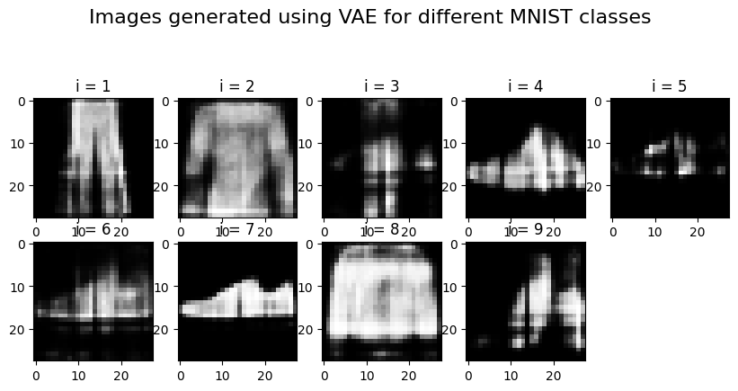
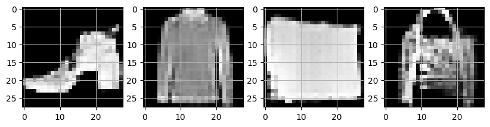

# Generative AI Implementation Notebooks

Welcome to the Generative AI Implementation Notebooks repository. This repository contains detailed implementations of various generative AI models, including Autoencoders, Variational Autoencoders (VAEs), Generative Adversarial Networks (GANs), and Stable Diffusion models. Each notebook provides a step-by-step guide, code, and explanations to help you understand and implement these models effectively.

## Table of Contents

- [Introduction](#introduction)
- [Autoencoder](#autoencoder)
  - [Implementation](#implementation)
  - [Generated Images](#generated-images)
- [Variational Autoencoder (VAE)](#variational-autoencoder-vae)
  - [Implementation](#implementation-1)
  - [Generated Images](#generated-images-1)
- [Generative Adversarial Network (GAN)](#generative-adversarial-network-gan)
  - [Implementation](#implementation-2)
  - [Generated Images](#generated-images-2)
- [Stable Diffusion](#stable-diffusion)
  - [Implementation](#implementation-3)
  - [Generated Images](#generated-images-3)
- [Contributing](#contributing)
- [License](#license)

## Introduction

This repository contains notebooks for implementing different generative AI models. These models are powerful tools for generating new data based on the patterns learned from existing data.

## Autoencoder

Autoencoders - Generative Model

Architecture: Input image -> Encoder --bottleneck--> latent vector(low-dim enbedding of the image) -> Decoder -> Reconstruct Image

Generative model as we generate the input image at the end based on the encodings. For Encoding and decoding the image we can use the feed forward Neural Networks or CNNs.
Once the model is trained we sent the encoded data to get the reconstructed image back from the encoded embeddings.

Losses: MSE between the input and reconstructed image.

Operations applied on the decoder (ConvTranspose2d) part is inverse of the operation applied on the encode (Conv2d) part.

### Implementation

The Autoencoder notebook demonstrates how to build and train a basic autoencoder using a popular deep learning framework.

[Link to Autoencoder Notebook](https://colab.research.google.com/drive/1weOOJ2U9jZXr1YaoFSEu3eHdhxQzacQd)

### Generated Images

Here are some images generated by the Autoencoder model:

## Variational Autoencoder (VAE)

Variational Autoencoders (VAEs): In VAEs, we introduce a probabilistic approach. Instead of having a deterministic encoder, we have a probabilistic encoder that outputs the parameters of a probability distribution over the latent space. This distribution is usually assumed to be Gaussian.
Latent Space Representation:: Let's say our encoder produces two parameters: μ (mean) and σ (standard deviation). So, instead of encoding x into a single point z, we encode it into a distribution over q(z∣x)=N(μ,σ2).
Reparameterization:

In VAEs, during training, we need to sample from the latent space distribution, which is parameterized by the mean (μ) and the log-variance (log(σ^2)) produced by the encoder. However, directly sampling from this distribution using μ and σ would make backpropagation through the sampling operation impossible, as it introduces a discontinuity in the computation graph. To overcome this issue, the reparameterization trick is used. Instead of sampling directly from the distribution with parameters μ and σ, we introduce a new variable ϵ sampled from a unit Gaussian distribution (N(0,1)). Then, we reparametrize z as follows:

z=μ+σ⋅ϵ

Where: • μ is the mean vector produced by the encoder. • σ is the standard deviation (or its logarithm) produced by the encoder. • ϵ is a random noise vector sampled from a unit Gaussian distribution.

This reparameterization separates the stochastic part (ϵ) from the deterministic part (μ and σ), allowing gradients to flow through the deterministic path during backpropagation. This enables efficient optimization of the model parameters via gradient descent.

           +-----------------------------------------------------+
           |                                                     |
           |           μ (mean), (log(σ^2)) (log(variance))      |
           +----------+---------------------------+--------------+
                      |                           |
                      |                           |
           +----------v---------------------------v--------------+
           |                                                     |
           |            Latent Space   z=μ+σ⋅ϵ      ϵ~N(0,1)      |
           |                                                     |
           +-----------------------------------------------------+

### Implementation

The Variational Autoencoder (VAE) notebook covers the implementation of a VAE, a type of autoencoder that generates more diverse outputs.

[Link to VAE Notebook](https://colab.research.google.com/drive/1TZlv26cq3QIUJJ2E3LcVTQVq7c0gk8n4#scrollTo=ZELxFOEhuHlW)

### Generated Images

Here are some images generated by the VAE model:

## Generative Adversarial Network (GAN)

Generative Adversarial Networks (GANs) are a class of machine learning frameworks designed to generate new data samples that resemble a given dataset. GANs were introduced by Ian Goodfellow and his colleagues in 2014. They consist of two neural networks, the Generator, and the Discriminator, which are trained simultaneously through an adversarial training process.

Key Components of GANs:

Generator (G):

• The Generator's role is to produce new data samples from a random noise vector ~ N(0,1).

• It aims to generate data that is indistinguishable from real data.

• The Generator takes a noise vector z (typically sampled from a standard normal distribution) and transforms it into a data sample G(z).

Discriminator (D):

• The Discriminator's role is to differentiate between real data samples and those generated by the Generator.

• It outputs a probability indicating whether a given sample is real (from the dataset) or fake (generated by the Generator).

• The Discriminator takes a data sample x and outputs a scalar D(x), representing the probability that x is real or fake.

GAN Training:

- The Discriminator aims to maximize the probability of correctly identifying real and fake samples. Its objective function is:

  $$
  \max_D \ \mathbb{E}_{x \sim p_{\text{data}}} [\log D(x)] + \mathbb{E}_{z \sim p_z} [\log (1 - D(G(z)))]
  $$

- The Generator aims to minimize the probability that the Discriminator correctly identifies fake samples. Its objective function is:

  $$
  \min_G \ \mathbb{E}_{z \sim p_z} [\log (1 - D(G(z)))]
  $$

### Implementation

The Generative Adversarial Network (GAN) notebook details the creation and training of a GAN, a model where two networks compete to improve the generation process.

[Link to GAN Notebook](https://colab.research.google.com/drive/1P47zGtWIdbGcycXHIGeQNUH1mZWbaGRO#scrollTo=HGbmc8lFJcUQ)

### Generated Images

Here are some images generated by the GAN model:

## Contributing

We welcome contributions to improve and expand these notebooks. Please read our [Contributing Guidelines](CONTRIBUTING.md) for more information.

## License

This project is licensed under the MIT License. See the [LICENSE](LICENSE) file for details.
